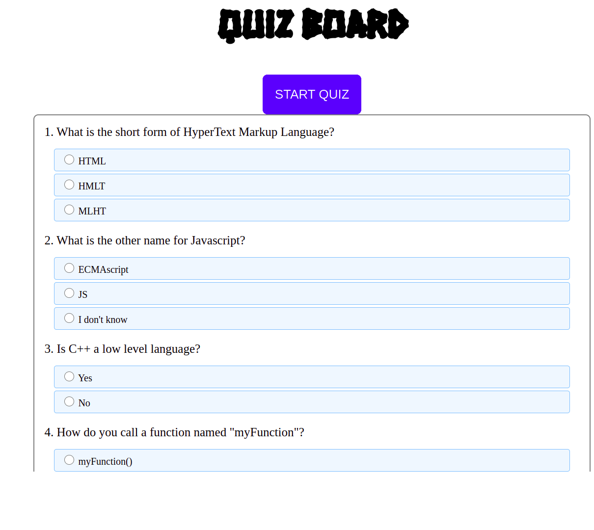

# Quiz Board
 ## By Bonface Masira
## Screenshot
 

 ## Table of Content
 - [Description](#description)
 - [Features](#features)
 - [Behaviour Driven Development](#Behaviour-Driven-Development)
 - [Requirements](#requirements)
 - [Installation Process](#installation-Process)
 - [Live Link](#Live-Link)
 - [Technology  Used](#technology-Used)
 - [Licence](#licence)
 - [Authors Info](#Authors-Info)
 ## Description

 
This project is a web application for Quiz Board that allows a user to take a Test and display the results on he screen

## Features
As a user of the application,you will be able to :
1. See see the questions in the Quiz Board
2. Select the aswers choices for the questions
3. Get a result on the Test

## Behaviour Driven Development|
| Behaviour      | Input        | Output       |
| :------------- | :----------: | -----------: |
|  Enter your name  |   Bonface Masira |     |
| Enter your Email Address  | bonface.masira@student.moringaschool.com |   |
| Enter your message or comment   |  I would like to inquire about something     |     |
| Press Submit|     |Pop up "Bonface Masira , we have received your message. Thank you for reaching out to us.|

 ###  Requirements
 * Access to  a computer or any other garget
 * Access to internet

 ### Installation Process
 ****
* Clone to thir repo : git clone https://github.com/bonfacemasira/Quiz-Board.git
* Unzip the downloaded files in a folder of choice.
* Open the index file from the zipped file with any browser.
 ****

### Live Link
- Click this link to view the live application 
### Technology  Used
* HTML - which was used to develope the structure of the web application
* CSS - which was used to style the web pages
* JavaScript - which was used for adding functionality to the web page elements.

## Known Bugs
* The result button is work in progress

## Licence
MIT License
Copyright (c) [2022] [Bonface Masira]
Permission is hereby granted, free of charge, to any person obtaining a copy
of this software and associated documentation files (the "Software"), to deal
in the Software without restriction, including without limitation the rights
to use, copy, modify, merge, publish, distribute, sublicense, and/or sell
copies of the Software, and to permit persons to whom the Software is
furnished to do so, subject to the following conditions:
The above copyright notice and this permission notice shall be included in all
copies or substantial portions of the Software.
THE SOFTWARE IS PROVIDED "AS IS", WITHOUT WARRANTY OF ANY KIND, EXPRESS OR
IMPLIED, INCLUDING BUT NOT LIMITED TO THE WARRANTIES OF MERCHANTABILITY,
FITNESS FOR A PARTICULAR PURPOSE AND NONINFRINGEMENT. IN NO EVENT SHALL THE
AUTHORS OR COPYRIGHT HOLDERS BE LIABLE FOR ANY CLAIM, DAMAGES OR OTHER
LIABILITY, WHETHER IN AN ACTION OF CONTRACT, TORT OR OTHERWISE, ARISING FROM,
OUT OF OR IN CONNECTION WITH THE SOFTWARE OR THE USE OR OTHER DEALINGS IN THE
SOFTWARE.

## Authors Info
Slack Profile - [Bonface Masira](https://app.slack.com/client/T0101L740P4/C010E0J8BRA/user_profile/U03DNHF0QKA)
Linked - [Bonface Masira](https://www.linkedin.com/in/bonface-masira-975447a4)